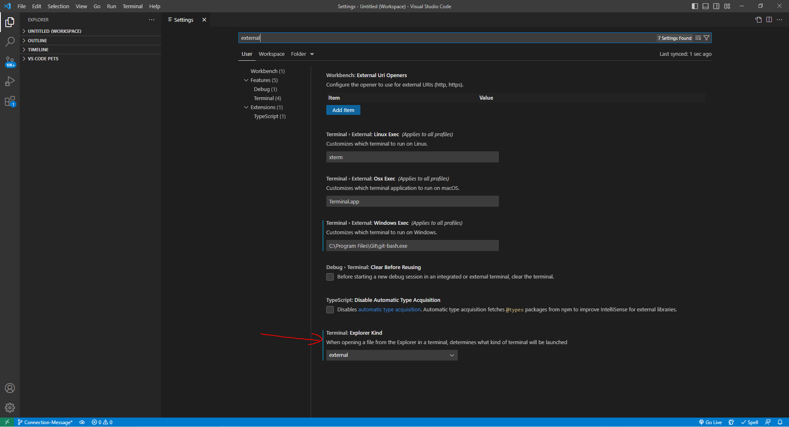

# MERN Book Search Engine

## Description

This M.E.R.N. project that utilizes MongoDB Database (a NoSQL Database), Express.JS, React, and Node to create a full stack application where users can look up books using the Google Books API. The books returned in the research contain an image, the book title, description, author, and Google Book link. Users can save these book results into a list.

The main object of this project was to refactor this application from using a RESTful API to using a GraphQL API with an Apollo Server.

## Table of Contents
- [Installation](#installation-for-further-development-only)
    - [Git/GitBash](#gitgitbash---strongly-recommended)
    - [Visual Studio Code](#visual-studio-code-vsc---strongly-recommended)
    - [Node (REQUIRED)](#node-version-16---required-to-download-node-based-dependencies-ie-react)
    - [dependencies (REQUIRED)](#dependencies---required)
- [Usage](#usage)
    - [Commands (Further Development Only)](#the-following-commands-are-for-further-development-only-and-come-from-react)
- [Credits](#credits)
- [Questions](#questions)

## Installation (for further development only)

Make sure the following are downloaded:

### `Git/GitBash` - *Strongly Recommended*
* While this application can be run using with the default **command prompt**, it is easier to clone this repository by using Git/GitBash, which can be downloaded [here](https://git-scm.com/downloads).

### `Visual Studio Code [VSC]` - *Strongly Recommended*

* If you'd like to make changes to these files, Visual Studio Code is recommended and can be downloaded for free [here](https://code.visualstudio.com/download).

### `Node version 16` - **REQUIRED** to download node-based dependencies (i.e. react)
* Go to [Node's homepage, https://nodejs.org/en/](https://nodejs.org/en/), then [Downloads](https://nodejs.org/en/download/) and scroll down to the [Previous Releases](https://nodejs.org/en/download/releases/) bullet point. 

* Toggle between the results until the desired version 16 package and click Download. This application was developed with [Node.js version 16.18.0](https://nodejs.org/dist/v16.18.0/), click on [node-v16.18.0-x64.msi](https://nodejs.org/download/release/v16.18.0/node-v16.18.0-x64.msi) to download.

* The Full-Stack Blog also has [instructions on how to download Node](https://coding-boot-camp.github.io/full-stack/nodejs/how-to-install-nodejs).

### `dependencies` - **REQUIRED**

* These **MUST** be installed into this repository, start by opening the command line interface.

* If you have Visual Code Studio, add this repository to the workspace. Then, go to 'Settings' either through the cog icon in the lower left corner and clicking Settings, go to File -> Preferences -> Settings in the menu bar, or the key combo of Ctrl+,

Method 1 - Cog:

Method 2 - File > Preferences > Setting:

* Then, change the settings in "Terminal: Explorer Kind" to "external" in the drop down menu.

        
* Change the filepath of the "Terminal > External: [respective operating system]" settings to the preferred command line interface program (either your system's Command Prompts's file path or Git/Git Bash's file path)

* After that, right-click the repository and select "Open in External Terminal"

* If you do not have VSC, open the preferred terminal.

* Use "cd Desktop" to first reach the Desktop, cd stands for change directory.

* Continue using "cd" to navigate through the file path to reach the location of this repository on your computer.

* Once the root directory of this repository has been reached, due to the large amount of dependencies, type in `npm run install` to install all dependencies. This will include all the dependencies written in the `package.json` file

## Usage

* This full-stack application's online version is deployed [here](https://book-search-leeclaire156.herokuapp.com/) on Heroku. After clicking the link, click on the search engine and type in a book title of your choice.

* If you're logged in, click on the blue button that says "Save this book!" found under the book's summary to add the book to your user's list. Once this is clicked, the button will disable and say "This book has already been saved!". 

* The user's book list can be found in the upper right hand corner by clicking "See Your Books". Users can delete books from their list with the red button that says "Delete this Book!" found under the book's summary. To go back to the search engine, click on "Search for books" in the upper right hand corner.

* If you're not logged in, you will not see this blue button in the book results.

* Users can toggle between logging in on signing up with "Login/Sign Up" in the upper right hand corner.

### The following commands are for further development only and come from React

* In the project directory, you can run:

### `npm develop`

Runs the app in the development mode.\
Open [http://localhost:3001](http://localhost:3001) to view it in your browser.

The page will reload when you make changes.\
You may also see any lint errors in the console.

### `npm run build`

Builds the app for production to the `build` folder.\
It correctly bundles React in production mode and optimizes the build for the best performance.

The build is minified and the filenames include the hashes.\
Your app is ready to be deployed!

See the section about [deployment](https://facebook.github.io/create-react-app/docs/deployment) for more information.

## Credits

* Adding useNewUrlParser and useUnifiedTopology decision made by the information provided in [mongoose's](https://mongoosejs.com/) official documentation:  https://mongoosejs.com/docs/deprecations.html

* Book `input` type used in `server/schemas/typeDefs.js` information provided by [GraphQL](https://graphql.org/):  https://graphql.org/graphql-js/mutations-and-input-types/

* Book `input` type used in `server/schemas/typeDefs.js` additional information provided by [Apollo GraphQL](https://www.apollographql.com/):  https://www.apollographql.com/tutorials/side-quest-intermediate-schema-design/03-the-input-type

* Optional Chaining information provided by [Mozilla MDN](https://developer.mozilla.org/):  https://developer.mozilla.org/en-US/docs/Web/JavaScript/Reference/Operators/Optional_chaining

## Questions

If you have any questions, my GitHub profile is www.github.com/leeclaire156, and my email is lee.claire156@gmail.com.